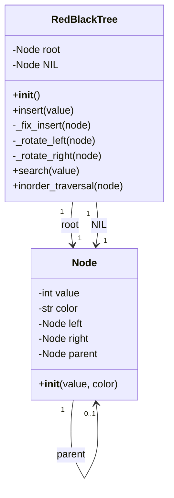

Welcome to a Python implementation of Red Black Trees created in collaboration by Kalum Fischer and John Markham to satisfy requirements of a group project for CS315 - Data structures and algorithms.
A red black tree is a self balancing binary search  tree where each node is assigned a color (red or black) and must follow a set of rules to ensure the tree remains balanced. 
RULES:
  Every node must be either Red or Black
  Root is always black
  Red nodes CANNOT have red children
  Every path from root to any leaf node MUST have the same number of black nodes
  All empty/left/NIL nodes are black

